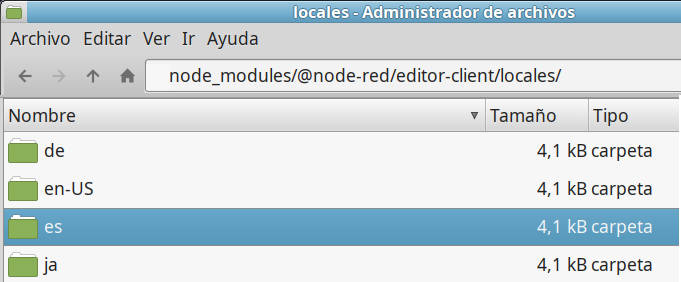
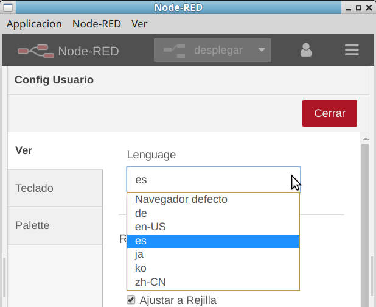
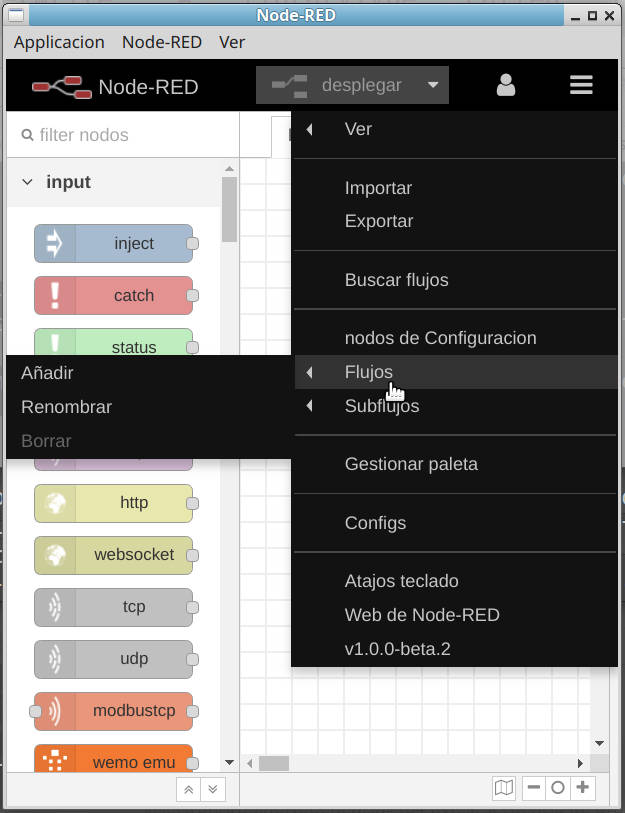

# Traduccion_es_Node-Red
aqui dejo una carpeta con la traduccion a español de la ultima (v1) version de node red.

colocar esta carpeta en /node_modules/@node-red/editor-client/locales/
 

Para que el entorno Node-Red la reconozca.

Despues en Node-Red ir a Settings = > language y seleccionar es
 

y el entorno node-red ya deberia aparecer en español.
 

